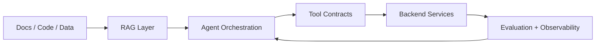

<div align="center">

# Harshvardhan Joshi

### AI/ML Engineer · LLM Systems · Agentic Workflows · Backend Automation · HLD/System Design

I build practical AI systems that connect **machine learning**, **backend engineering**, **automation**, **evaluation**, and **system design** into reliable engineering workflows.

[](https://www.linkedin.com/in/harshvardhanjoshi23)
[](https://github.com/harshjoshi23)
[](mailto:harsh.joshi23@gmail.com)
[](./RESUME.md)

</div>

---

## System Identity

```yaml
name: Harshvardhan Joshi
role: AI/ML Engineer
location: Germany
experience: 4+ years across software engineering, ML systems, backend, and automation
current_focus:
  - Multi-agent AI workflows for embedded-system validation
  - Retrieval-augmented reasoning and structured input generation
  - HLD, API design, database design, and scalable architecture
  - Observability, evaluation, and production-oriented AI deployment
```

---

## Current Mission

I am currently developing **multi-agent AI workflows for embedded-system validation**. The work combines:

- retrieval-augmented constraint extraction
- tool orchestration and agentic reasoning
- structured input generation
- evaluation workflows
- observability and tracing
- scalable controller-based architecture using HLD and LLD patterns

---

## Architecture Mindset



I like systems that are not only impressive in a notebook, but also **usable, testable, observable, and automatable**.

---

## Core Strengths

| Area | Stack |
|---|---|
| Programming | Python, C/C++, SQL, Java, JavaScript, Node.js, Groovy |
| AI / ML | PyTorch, TensorFlow, scikit-learn, XGBoost, CNNs, NLP, recommendation systems |
| LLM Systems | RAG, LangChain, LangGraph, CrewAI, ReAct agents, vector search, prompt engineering |
| System Design | HLD, API design, database design, design patterns, scalable architectures |
| Backend | FastAPI, Flask, REST APIs, microservices, OAuth workflows, state management |
| Data / Storage | PostgreSQL, MySQL, MongoDB, Redis, FAISS, Pinecone, ETL/ELT pipelines |
| Infra / DevOps | Docker, Kubernetes, Git, GitLab CI/CD, Jenkins, AWS, GCP, observability, tracing |
| Domains | Embedded validation, industrial inspection, network automation, financial risk modeling, conversational AI |

---

## Featured Project Constellation

<table>
<tr>
<td width="50%" valign="top">

### LLM-Guided Engineering Automation

Multi-agent AI workflows for embedded validation, documentation-driven reasoning, structured input generation, and evaluation pipelines.

**Stack:** Python · C/C++ · Docker · LangGraph · RAG · FAISS · HLD · Observability

</td>
<td width="50%" valign="top">

### Industrial CT Scan Segmentation

Semantic segmentation for industrial CT scans focused on hairpin-stator welding inspection with U-Net-style architectures.

**Stack:** Python · PyTorch · Docker · Label Studio · Pandas · NumPy

</td>
</tr>
<tr>
<td width="50%" valign="top">

### CamVid Urban Scene Segmentation

Pixel-level semantic segmentation for road-scene understanding.

[Repository](https://github.com/harshjoshi23/CamVid-obj-segmentation)

**Stack:** Python · PyTorch · Computer Vision · Image Segmentation

</td>
<td width="50%" valign="top">

### B2B Invoice Due Date Prediction

Machine learning workflow for predicting payment behavior and aging buckets in a fintech-style accounts-receivable setting.

[Repository](https://github.com/harshjoshi23/duedateprediction)

**Stack:** Python · scikit-learn · Pandas · SQL · Flask concepts

</td>
</tr>
<tr>
<td width="50%" valign="top">

### FastAPI and LLM Integration

Backend API prototype for exposing LLM-powered generation through REST endpoints.

[Repository](https://github.com/harshjoshi23/FastApi_OpenAI_Integration)

**Stack:** FastAPI · Pydantic · REST APIs · LLM integration

</td>
<td width="50%" valign="top">

### MindClinic

Responsible LLM wellness prototype exploring conversational AI, guided reflection, and safe product boundaries.

[Repository](https://github.com/harshjoshi23/MindClinic)

**Stack:** Conversational AI · Backend concepts · Responsible AI

</td>
</tr>
</table>

---

## Experience Snapshot

| Period | Role | Focus |
|---|---|---|
| 2025 | Working Student, Robust AI & Test Automation — Infineon Technologies | Embedded validation automation, CI/CD, diagnostics, evaluation workflows |
| 2025–Present | Master's Thesis — FAU + Infineon | Multi-agent AI workflows, RAG, structured generation, observability, HLD |
| 2023–2025 | Working Student, Software Development — RRZE | Academic workflow systems, MySQL, REST APIs, CI/CD |
| 2022–2023 | Software Developer I — Lumen Technologies | Network automation, backend services, telemetry ETL, microservices |
| 2021–2022 | Machine Learning Intern — HighRadius Technologies | ML pipelines, financial document processing, payment-delay prediction |

---

## What I Am Learning Next

- **MCP-style tool integration:** reliable tool contracts, server design, and permission boundaries
- **Agent evaluation:** task success, tool-call quality, regression tests, trace-based debugging
- **LLM observability:** tracing, latency, cost, failure classification, and workflow reliability
- **Secure agent design:** tool metadata review, guardrails, least-privilege execution, auditability
- **Production RAG:** retrieval quality, chunking strategy, reranking, hybrid search, evaluation datasets
- **HLD for AI systems:** scalable architecture, API boundaries, database design, state management, deployment strategy

---

## Selected Repositories

- [CamVid Urban Scene Segmentation](https://github.com/harshjoshi23/CamVid-obj-segmentation)
- [B2B Invoice Due Date Prediction](https://github.com/harshjoshi23/duedateprediction)
- [Object Segmentation with TensorFlow](https://github.com/harshjoshi23/Object_segmentation_TF)
- [Object Detection on COCO](https://github.com/harshjoshi23/Object_detection_COCO)
- [FastAPI and LLM Integration](https://github.com/harshjoshi23/FastApi_OpenAI_Integration)
- [MindClinic](https://github.com/harshjoshi23/MindClinic)

---

## Contact

- LinkedIn: https://www.linkedin.com/in/harshvardhanjoshi23
- GitHub: https://github.com/harshjoshi23
- Email: harsh.joshi23@gmail.com
- Resume highlights: [RESUME.md](./RESUME.md)

---

<div align="center">

**Building AI systems that are useful, testable, observable, and production-minded.**

</div>
